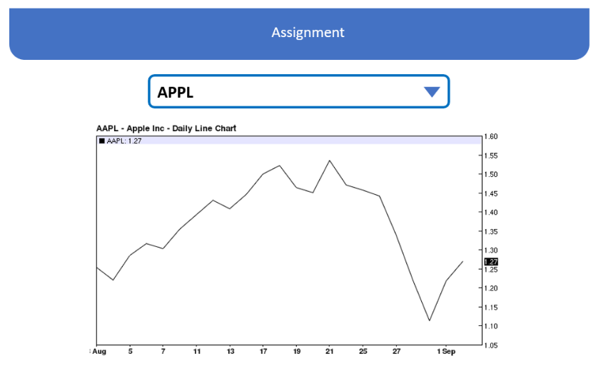

# โจทย์ : Spring-boot

ขอขอบคุณที่ให้ความสนใจในการทำงานกับเราและสละเวลาเพื่อช่วยให้เราคุ้นเคยกับทักษะวิชาชีพของคุณ

การทดสอบนี้เป็นโอกาสของคุณที่จะแสดงความเป็นเลิศทางเทคนิคของคุณ มันเป็นส่วนสำคัญในการแสดงว่าคุณเป็นใครและสิ่งที่คุณเป็น

ในหลาย ๆ ด้านการทดสอบนี้สำคัญกว่าเรซูเม่ที่คุณส่งมาให้เรา มันบอกเราเกี่ยวกับตัวเลือกที่คุณทำในฐานะนักพัฒนาและวิธีที่คุณแก้ปัญหาที่เกิดขึ้นกับคุณ


### แนวทางในการทำ

- ไม่มีการจำกัดเวลาในการทำภารกิจนี้ แต่แนะนำให้ใช้เวลาเพียง 4 ชั่วโมงเพื่อให้เสร็จสมบูรณ์
- โปรดใช้แนวทางการเขียนโปรแกรมที่ดีเพื่อแก้ไขปัญหา
- โปรดให้การทดสอบหน่วยอัตโนมัติ ( Automate Unit Test )
- โปรดส่ง Source code ของคุณเป็น link ไปยัง `GIT Repository` ที่ใดที่หนึ่งพร้อมกับประวัติการ commit
- โปรดส่งวิธีแก้ปัญหาที่มีคุณภาพตามมาตรฐานการทำงานจริงของคุณ
- การพัฒนา front-end **ไม่ใช่** ส่วนหนึ่งของงานที่มอบหมายนี้


### ข้อกำหนด

```
- Spring-boot (required)
- Maven (required)
- In-memory Database (required)
- ORM framework e.g. JPA (Preferable)
```


### รายละเอียดงานที่ได้รับมอบหมาย

ออกแบบและดำเนินโครงการ `spring-boot` ด้วย Stock RESTful API ต่อไปนี้ 
โดยสามารถเลือก API Endpoints อื่นได้ตามความเหมาะสม ไม่จำเป็นที่จะต้องใช้ `batch-requests` :

```
https://iextrading.com/developer/docs/#batch-requests
```

- **ส่วนที่ 1: ** ดึงและแยกข้อมูล Stock Value แบบเป็นจังหวะ (Periodically) ของบริษัทต่อไปนี้
   - `Apple` (APPL)
   - `Facebook` (FB)
   - `Google` (GOOGL)
   - และ `Microsoft` (MSFT) จาก Stock API และเก็บผลลัพธ์ไว้ในฐานข้อมูล

- **ส่วนที่ 2: ** สร้าง  JSON RESTful web service เพื่อให้ข้อมูลเหล่านั้นไปยังหน้าจอ

   

### ตัวอย่างหน้าจอที่รับข้อมูลจาก `Assignment`




----


## Assignment: Spring-boot

Thank you for your interest in working with us and taking the time to help us get familiar with your professional skills.

This test is your opportunity to show of your technical excellence. It is an important part in showing who you are and what you stand for.

In many aspects this test is more important than the resume you sent us. It tell us about choices you make as a developer, and how you solve problem presented to you.

### Guidelines

- There is no time limit to do this assignment but recommended for 4 hours to complete.
- Please use good programming practices when solving the problem.
- Please provide automated unit tests.
- Please submit your code as a link to a `GIT repository` somewhere with all the commit history.
- Please submit a solution that has the quality of your real work standards.
- Developing the front end is **NOT** part of this assignment


### Requirements

```
- Spring-boot (required)
- Maven (required)
- In-memory Database (required)
- ORM framework e.g. JPA (Preferable)
```


### Assignment Descriptions

Design and implement `spring-boot` project with following stock API document: 

```
https://iextrading.com/developer/docs
```

- **Part 1:** Periodically fetch and parse out the stock value of 
  - `Apple`  (APPL)
  - `Facebook` (FB)
  - `Google`  (GOOGL)
  - and `Microsoft`  (MSFT) from Stock API and store the result in the database
- **Part 2:** Create JSON RESTful web service to provide those data to a front-end


### Example Screen which use `Assignment` as backend

